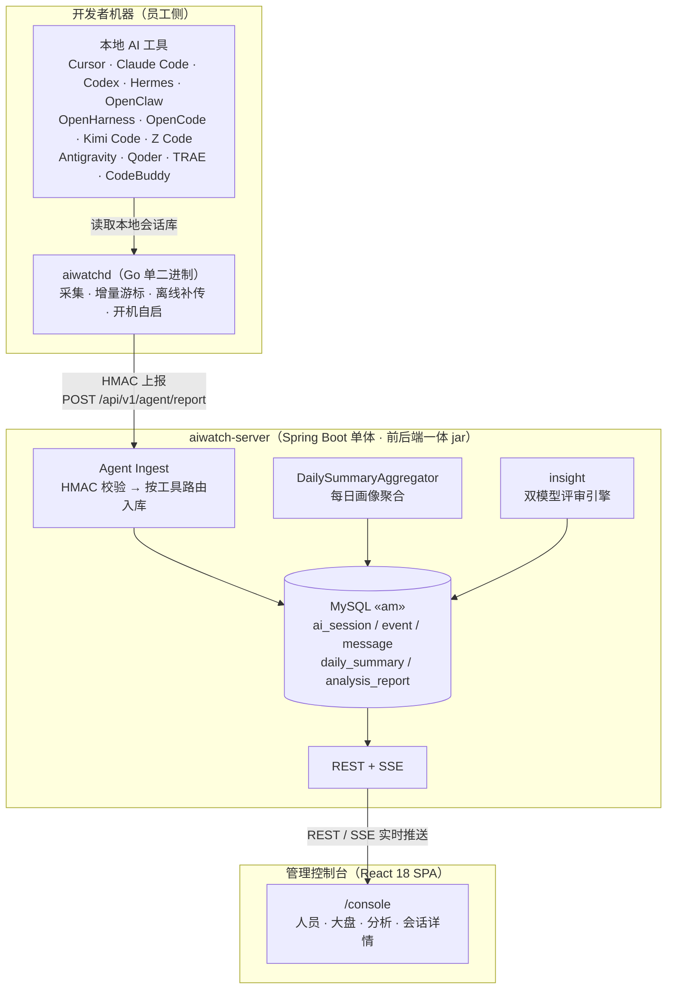
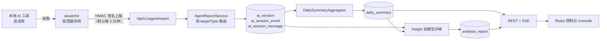
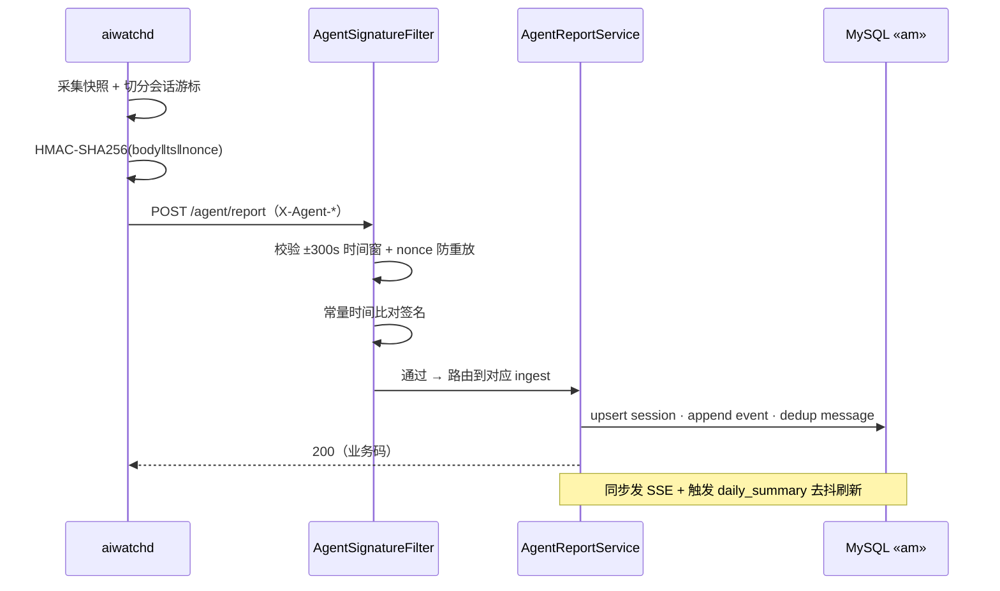

<div align="center">


# AIWatch

**面向研发团队的 AI 使用观测与洞察平台**

读取每位开发者机器上的本地 AI 工具会话，量化「AI 用得有多深、有多好、产出了什么」。


</div>

---

## 这是什么

AIWatch 在每台开发机上运行一个 Go 单二进制客户端（**aiwatchd**），自动读取本地 AI 编码工具的会话存储并安全上报；服务端（**aiwatch-server**，Spring Boot 单体）负责入库、聚合、评分，并提供一个内置的 React 管理控制台。它回答三个问题：

1. **AI 用得有多深** —— 员工 / 团队 / 项目层面的渗透率与依赖度
2. **AI 用得有多好** —— 会话健康度、模型选择、工具使用效率
3. **AI 产出了什么** —— 可量化的产出（提交、token、协作时长）与可优化的浪费（沉默、重试、卡壳）

> [!NOTE]
> 员工**无需登录后台**：拿到安装页地址 → 复制一行命令执行即可，客户端自助注册并开机自启。
> 后台仅供管理员，入口在 `/console`（根路径 `/` 是公开安装落地页，不暴露任何后台页面/接口）。

---

## 支持的 AI 编码工具

启动后由客户端自动检测、增量适配，无需手动开关。服务端可在「Agent 列表」按工具启停白名单。

| 工具 | `type_code` | 数据源 | 平台 |
| --- | --- | --- | --- |
| Cursor | `cursor` | `state.vscdb`（SQLite） | mac · Win · Linux |
| Claude Code | `claude` | `~/.claude/projects/**/*.jsonl` | mac · Win · Linux |
| Codex CLI | `codex` | `~/.codex/sessions/**/rollout-*.jsonl` | mac · Win · Linux |
| Hermes Agent | `hermes` | `~/.hermes/state.db`（SQLite） | mac · Linux · WSL2 |
| OpenClaw | `openclaw` | `~/.openclaw/agents/**/sessions/*.jsonl` | mac · Win · Linux |
| OpenHarness | `openharness` | `~/.openharness/data/sessions/**/session-*.json` | mac · Win · Linux |
| OpenCode | `opencode` | `~/.local/share/opencode/opencode.db`（SQLite） | mac · Win · Linux |
| Kimi Code | `kimicode` | `~/.kimi-code/sessions/**/wire.jsonl` | mac · Win · Linux |
| Z Code（z.ai GLM） | `zcode` | `~/.zcode/cli/db/db.sqlite`（SQLite） | mac · Win · Linux |
| Antigravity | `antigravity` | `~/.gemini/antigravity/conversations/*.pb` + `state.vscdb` 索引 | mac · Win · Linux |
| Qoder / QoderWork | `qoder` | `~/.qoder/projects/**/transcript/*.jsonl` / `~/.qoderwork/projects/**` | mac · Win · Linux |
| TRAE / TRAE SOLO | `trae` | workspace `state.vscdb`（`ChatStore` / icube chat storage） | mac · Win · Linux |
| CodeBuddy | `codebuddy` | `codebuddy-sessions.vscdb` + 可选 `genie-history/messages.json[l]` | mac · Win · Linux |
| Git 提交 | `gitlog` | 本地 git 仓库 `git log`（按作者邮箱归因） | 全平台 |

> [!TIP]
> 新增一个采集器只发生在 `agent/internal/monitors/<tool>/` —— 实现 `monitor.Provider` 四个方法并在 `cmd/agent/main.go` 注册即可，详见 [`agent/internal/monitors/CLAUDE.md`](agent/internal/monitors/CLAUDE.md)。

---

## 系统架构



| 组件 | 路径 | 职责 |
| --- | --- | --- |
| **aiwatchd** | `agent/` | 本机采集，HMAC 上报会话、工具事件与 git 提交 |
| **aiwatch-server** | `server/` | 鉴权、入库、聚合、LLM 分析、REST/SSE、内置前端 |
| **控制台** | `server/src/main/frontend/` | React + Vite + AntD，打进同一个 jar |
| **MySQL** | 库 `am` | 单文件幂等 schema，无 Flyway |

---

## 端到端数据流



> [!IMPORTANT]
> `daily_summary`（实时、核心底表）≠ `usage_report`（v1.x 遗留、当前无写入方）。
> 现役「报告」是 insight 的 `analysis_report`，经 `POST /api/v1/admin/analysis/generate` 生成。

**v1.3.0 新增两条派生链**（规格：[`docs/design/管理后台-产出归因与能力使用分析-v1.0.md`](docs/design/管理后台-产出归因与能力使用分析-v1.0.md)）：

- 会话流水 → `CapabilityDailyAggregator` → **`capability_daily`** → 控制台 **`/capability`** 能力分析（Skill / 插件 MCP 两 tab，接口 `GET /api/v1/admin/capability/{ranking|trend|matrix|user}`）
- `git_commit` × 会话窗口 → `GitCommitAttributionEngine` → **`git_commit_attribution`**（B 确定 / A 疑似 / NONE，每非 merge commit 一行）→ 控制台 **`/attribution`** 归因分析（接口 `GET /api/v1/admin/attribution/{trend|pivot|commits|penetration-check}`）；北极星 **AI 渗透率**自本版起主读该表（回溯未完成时自动退回旧查询时 JOIN 口径）
- 两张表都是纯派生物，启动期自动建表 + 全量回溯（sys_config marker），口径变更可整表重算；性能测量端点 `GET /api/v1/admin/perf/slow-requests`（>1s 慢接口清单）

---

## 安全与鉴权

- **客户端 ↔ 服务端：HMAC-SHA256**。每次上报对 `body‖ts‖nonce` 签名，置于 `X-Agent-Id / X-Agent-Ts / X-Agent-Nonce / X-Agent-Sign`；服务端校验 ±300 秒时间窗 + nonce 防重放 + 常量时间比对。`/api/v1/agent/register` 是唯一免签端点。
- **管理端：双通道**。已登录后台 session（7 天滑动，`AIWATCH_USER` / `AIWATCH_PASSWORD`）**或** `X-Admin-Token` 头（`AIWATCH_ADMIN_TOKEN`）。`/api/v1/admin/**` 强制鉴权，空/默认凭据会被启动守卫拒绝上线。
- **后台隐藏**：`ConsoleAccessFilter` 可经 `console.ip_allowlist` 把 `/console` 与 admin/dashboard 接口限制到管理员 IP 段（留空=放行）。



---

## 技术栈

| 层 | 技术 |
| --- | --- |
| 客户端 `aiwatchd` | **Go 1.25**，单二进制，module `github.com/am/aiwatch-agent` |
| 后端 `aiwatch-server` | **Spring Boot 3.2.5 / JDK 17**，Gradle 8.7（wrapper），Spring Data JPA / Hibernate 6 |
| 前端 `aiwatch-web` | **React 18 / Vite 5 / TypeScript / Ant Design 5**（Node 22.14 + pnpm 由 Gradle node 插件托管，本机无需装）|
| 数据库 | **MySQL 8.x**，库名 `am`，`utf8mb4` |
| Schema 治理 | 不引入 Flyway/Liquibase，单文件幂等 `server/src/main/resources/sql/schema.sql` + 启动期 `*SchemaPatches` 补列 |

---

## 快速开始

### 方式一：Docker（推荐）

```bash
cp .env.example .env          # 填 MYSQL_ROOT_PASSWORD / DB_USERNAME / DB_PASSWORD
docker compose build          # 多阶段：编前端+后端 jar、四平台 agent 分发包
docker compose up -d
curl http://localhost:9527/actuator/health     # 期望 {"status":"UP"}
```

浏览器访问 `http://<服务器IP>:9527/console`，用默认 `admin / admin` 登录后**立即改密码与 Token**。
完整 CentOS 部署、镜像加速、离线方案见 [`docs/guides/docker-deploy-centos.md`](docs/guides/docker-deploy-centos.md)。

### 方式二：本地开发

```bash
# 后端（dev profile，:8081，自动导入 schema.sql 到 MySQL「am」）
cd server && ./gradlew bootRun

# 前端热更（可选，:5173，代理 /api → 后端）
cd server/src/main/frontend && pnpm install && pnpm dev

# 客户端
cd agent && go test ./...
VERSION=1.3.1 bash build-dist.sh   # 交叉编译四平台 → dist/install/
```

> [!WARNING]
> 务必用仓库内的 **`./gradlew`（Gradle 8.7）**，不要用机器全局 `gradle`。
> 全局 9.2.x 会让 `io.spring.dependency-management` 在解析后改写 `runtimeOnly`，导致 `:test` / `bootJar` 硬失败。

**端口一览**：dev `8081` · prod / Docker `9527` · 前端 HMR `5173`。

---

## 员工侧安装

根路径 `/` 是面向员工的极简安装落地页：填 **公司邮箱/工号、姓名、部门** → 选系统 → 复制命令执行，**无需登录、无需 HR 预录入**。

```bash
# macOS / Linux（安装页会替员工填好工号/姓名/部门/服务端地址）
curl -fsSL https://aiwatch.example.com/install/aiwatchd.sh | bash -s -- \
  --user-code alice --user-name 张三 --department 研发部 \
  --server-url https://aiwatch.example.com
```

脚本会：下载二进制 → 装到用户目录（免 sudo）→ `aiwatchd init` 注册 → 注册开机自启（mac launchd / linux systemd --user / windows ScheduledTask）→ 立刻拉起。

<details>
<summary>高级用法 · 环境变量（<code>AM_*</code> 前缀）</summary>

`AM_SERVER_URL` · `AM_USER_CODE` · `AM_USER_NAME` · `AM_DEPARTMENT` · `AM_WATCH_DIR` · `AM_LOG_LEVEL=debug` · `AM_AUTO_UPDATE`

> **Git 提交归因**：后台只统计「提交 author 邮箱属于你本人允许集合」的记录。请在常用仓库配好 `git config user.email`；公司 noreply / 别名 / 历史邮箱可在本地 `config.json` 的 `git_author_emails`（字符串数组）补充。细则见 [`docs/design/员工AI产出-Git采集与归因方案-v1.0.md`](docs/design/员工AI产出-Git采集与归因方案-v1.0.md)。

</details>

---

## 目录结构

```text
.
├── agent/                Go 单二进制客户端 aiwatchd（module github.com/am/aiwatch-agent）
│   ├── cmd/agent/        CLI 入口（init / register / start / status / update / uninstall）
│   └── internal/         reporter · monitor · security(HMAC) · svcctl · updater
│       └── monitors/     每个 AI 工具一个子包（cursor/claude/codex/.../zcode/gitlog）
│
├── server/               Spring Boot 单体（前后端不分离，一个 jar）
│   ├── build.gradle      artifact = aiwatch-server，version 1.3.1
│   └── src/main/
│       ├── java/com/am/server/   web · agent · aggregator · insight · system · domain
│       ├── frontend/             React + Vite + TS + AntD（npm name = aiwatch-web）
│       └── resources/
│           ├── application*.yml  base 8080 / dev 8081 / prod 9527
│           └── sql/schema.sql    单文件幂等 DDL
│
├── docs/                 架构 / 设计 / 部署 / 规范文档
├── Dockerfile            多阶段：前端+后端 jar、四平台 agent、JRE 运行时
└── docker-compose.yml    server + MySQL（:9527）
```

---

## 文档地图

| 想了解 | 看这里 |
| --- | --- |
| 项目导航与机器可读约束 | [`AGENTS.md`](AGENTS.md) |
| 组件总览 | [`ARCHITECTURE.md`](ARCHITECTURE.md) |
| 代码分层规则与边界检查 | [`docs/architecture/LAYERS.md`](docs/architecture/LAYERS.md) |
| 产品方案设计（v2.0 主设计 / v1.x 存档） | [`docs/design/`](docs/design/) |
| Docker / CentOS 部署 | [`docs/guides/docker-deploy-centos.md`](docs/guides/docker-deploy-centos.md) |
| 客户端细节（采集 / 上报 / 生命周期） | [`agent/CLAUDE.md`](agent/CLAUDE.md) |
| 后端细节（ingest / 分层 / 鉴权） | [`server/CLAUDE.md`](server/CLAUDE.md) |
| LLM 分析引擎 | [`server/src/main/java/com/am/server/insight/CLAUDE.md`](server/src/main/java/com/am/server/insight/CLAUDE.md) |

---

## 版本

当前发布版本 **1.3.1**。本仓库由原 *ai-work-platform*（在线工时与成本核算）重定位为 **AIWatch**，去成本视角、聚焦 AI 使用观测；产品愿景见 [`docs/design/aiwatch-design-v2.0.md`](docs/design/aiwatch-design-v2.0.md)。包名 `com.am.server` 中的 `am` = *AI Monitoring*，非公司名。

**v1.3.1**：git 提交采集的可观测性与丢数修复——agent 每轮扫描固定打一行 `gitlog scan: repos=… new_commits=… filtered_by_email=… repos_without_identity=…`（此前"一个仓库都没发现"与"提交被作者邮箱过滤光"这两种最常见的空数据成因不打任何日志）；服务端 `/report-commits` 补成功路径汇总日志，并把逐条落库失败数经 `IngestSummary.failed` 回传，agent 据此**保留 gitlog cursor 重报**——此前失败条目照样返 200，cursor 一推进这些 commit 就永久丢失。**agent 有代码变更，需发版下发**（自动更新按 manifest 版本号字符串比对，同号重打包不会触发升级）。
