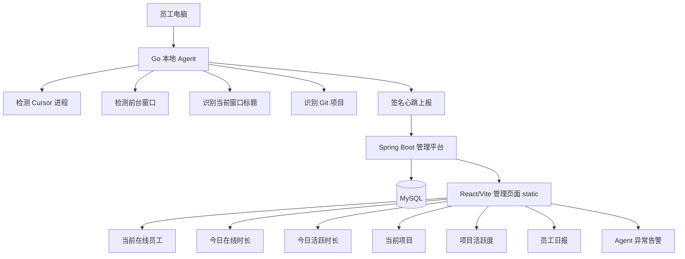
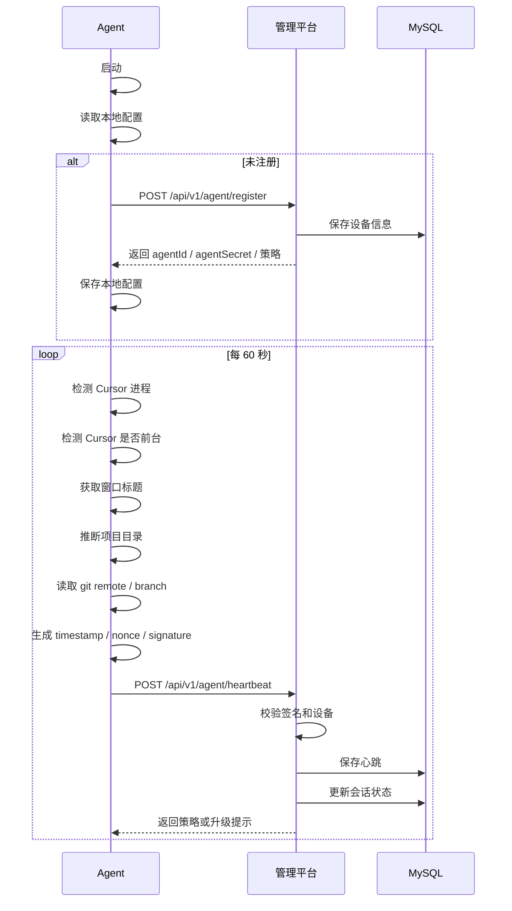

# Cursor 在线工时与项目活跃度管理平台设计文档

> 版本：v1.2  
> 目标：基于“Go 本地 Agent + Spring Boot 单体管理平台 + MySQL”的最简方案，实现员工 Cursor 在线状态、在线时长、活跃时长、当前开发项目识别与管理大盘统计。  
> 说明：本设计文档不约束管理平台项目结构，项目结构由研发团队自行设计。

---

## 1. 建设目标

团队希望建设一个轻量级管理大盘，用于查看当前正在使用 Cursor 工作的员工，并记录员工上线、下线、在线时长、活跃时长，尽可能识别员工当前开发项目。

本方案坚持最小化接入：

- 不要求每个项目放配置文件
- 不接入 Cursor Hook
- 不采集 prompt 内容
- 不采集 Cursor 聊天记录
- 不采集源码内容
- 不读取业务文件内容
- 不做键盘记录、截屏、剪贴板读取
- 不做 AI 行为审计
- 不做强制代码拦截
- 本地 Agent 无界面，后台运行

系统只通过本地 Agent 检测 Cursor 运行状态、前台窗口状态、当前项目 Git 信息，并以心跳方式上报管理平台。

---

## 2. 最终技术方案

```text
本地 Agent：Go 单二进制后台进程
管理平台：Spring Boot 单体应用
管理页面：React + Vite + TypeScript + Ant Design，打包后放入 Spring Boot static 目录
数据库：MySQL 8.x
部署方式：一个 Spring Boot jar + 一个 MySQL + 多端 Agent
```

管理平台对外表现为一个系统：

```text
http://ai-work-platform.xxx.com
```

同一个 Spring Boot 服务同时提供：

```text
1. 管理页面静态资源
2. Agent 注册接口
3. Agent 心跳接口
4. 在线大盘接口
5. 项目活跃度接口
6. 员工日报接口
7. Agent 异常告警接口
```

---

## 3. 总体架构



---

## 4. 核心边界

### 4.1 采集内容

| 信息 | 说明 |
|---|---|
| 员工账号 | 用于识别员工 |
| 设备标识 | 使用 hash 后的设备 ID |
| 主机名 | 用于排查设备 |
| 操作系统 | macOS / Windows / Linux |
| Agent 版本 | 用于升级和兼容性管理 |
| Agent 二进制 hash | 用于识别异常版本或被替换风险 |
| Cursor 是否运行 | 判断 Cursor 在线状态 |
| Cursor 是否前台 | 判断 Cursor 活跃状态 |
| Cursor 窗口标题 | 辅助识别项目 |
| 当前项目名 | 根据窗口标题、目录名、Git 仓库推断 |
| Git remote | 用于识别项目 |
| Git branch | 展示当前开发分支 |
| 心跳时间 | 用于计算在线时长和活跃时长 |

### 4.2 不采集内容

| 内容 | 原因 |
|---|---|
| prompt 内容 | 涉及个人输入和业务信息 |
| Cursor 聊天记录 | 隐私和安全风险高 |
| 源码内容 | 涉及业务资产和安全 |
| 文件内容 | 非本系统目标 |
| 密码、密钥、token | 严禁采集 |
| 浏览器记录 | 与本系统无关 |
| 键盘输入 | 风险高，不符合本系统目标 |
| 截屏内容 | 风险高，不符合本系统目标 |
| 剪贴板内容 | 风险高，不符合本系统目标 |
| 非 Cursor 应用行为 | 与本系统目标无关 |

---

## 5. 本地 Agent 设计

### 5.1 Agent 形态

本地 Agent 使用 Go 开发，编译为单二进制文件。

员工电脑不需要安装 Go 环境，不需要安装 Node.js，不需要安装 JDK。

发布形式：

```text
macOS Apple 芯片：ai-work-agent-darwin-arm64
macOS Intel：ai-work-agent-darwin-amd64
Windows：ai-work-agent-windows-amd64.exe
Linux：ai-work-agent-linux-amd64
```

### 5.2 Agent 命令

Agent 提供最少命令：

```bash
ai-work-agent install
ai-work-agent start
ai-work-agent stop
ai-work-agent status
ai-work-agent logs
ai-work-agent uninstall
```

命令说明：

| 命令 | 说明 |
|---|---|
| install | 安装 Agent，写入本地配置，注册开机启动 |
| start | 启动 Agent |
| stop | 停止 Agent |
| status | 查看运行状态 |
| logs | 查看本地日志 |
| uninstall | 卸载 Agent |

员工日常不需要手动执行命令，正常由公司统一安装后后台运行。

### 5.3 后台运行方式

#### macOS

优先使用 LaunchAgent：

```text
~/Library/LaunchAgents/com.company.ai-work-agent.plist
```

原因：需要识别当前用户的前台窗口，LaunchAgent 比 LaunchDaemon 更合适。

#### Windows

建议使用 Windows Service。

第一版如要快速落地，也可以使用开机启动项 + 后台进程，但正式版建议注册为 Windows Service。

#### Linux

建议使用 systemd user service。

---

## 6. Agent 核心流程



---

## 7. Cursor 状态识别

### 7.1 Cursor 进程检测

Agent 每个心跳周期检测 Cursor 是否运行。

识别进程名称：

| 系统 | 可能进程名 |
|---|---|
| macOS | Cursor |
| Windows | Cursor.exe |
| Linux | cursor / Cursor |

建议实现方式：

- macOS：通过 `ps` 或系统 API 获取进程列表
- Windows：通过 Windows API 或 `tasklist` 获取进程列表
- Linux：通过 `/proc` 或 `ps` 获取进程列表

### 7.2 前台窗口检测

Agent 需要判断当前前台应用是否 Cursor。

| 系统 | 建议方式 |
|---|---|
| macOS | AppleScript / CGWindow API |
| Windows | Win32 API：GetForegroundWindow / GetWindowText |
| Linux | xdotool / wmctrl / X11 API，Wayland 环境需要降级处理 |

前台窗口检测结果：

```text
cursorForeground = true / false
```

### 7.3 窗口标题获取

Agent 获取当前 Cursor 窗口标题，用于辅助识别项目。

常见窗口标题可能类似：

```text
payment-core - Cursor
refund-service - Cursor
user-center - Cursor
```

Agent 从标题中提取项目名：

```text
payment-core
refund-service
user-center
```

注意：窗口标题不是稳定 API，只作为辅助信息，不作为唯一依据。

---

## 8. 项目识别策略

项目识别不依赖项目内配置文件。

Agent 按以下优先级识别项目：

```text
1. 当前 Cursor 前台窗口标题
2. Cursor 最近工作区路径或进程相关路径
3. 当前活跃目录下的 Git remote
4. 当前活跃目录名
5. unknown
```

### 8.1 推荐唯一标识

项目唯一标识优先使用 Git remote。

```text
repoUrl = git@gitlab.xxx/payment/payment-core.git
```

如果没有 Git remote，则使用目录名作为兜底：

```text
projectName = payment-core
repoUrl = null
```

### 8.2 Git 信息读取

Agent 在推断出的项目目录中执行：

```bash
git remote get-url origin
git branch --show-current
```

得到：

```json
{
  "projectName": "payment-core",
  "repoUrl": "git@gitlab.xxx/payment/payment-core.git",
  "branchName": "feature/refund-fix"
}
```

### 8.3 本地路径处理

本地绝对路径不建议明文上报。

不要上报：

```text
/Users/zhangsan/work/payment-core
```

建议上报 hash：

```text
projectPathHash = sha256(localProjectPath)
```

---

## 9. 在线时间计算规则

系统区分两个概念：

| 指标 | 定义 |
|---|---|
| 在线时长 | Cursor 进程存在且 Agent 正常心跳 |
| 活跃时长 | Cursor 是当前前台应用且 Agent 正常心跳 |

如果用于管理大盘，建议展示两个指标：

```text
今日在线时长
今日活跃时长
```

如果要作为“工作时间”口径，建议使用活跃时长为主，在线时长作为参考。

### 9.1 心跳参数

默认参数：

```text
heartbeatIntervalSeconds = 60
maxHeartbeatGapSeconds = 180
```

### 9.2 连续会话判断

规则：

```text
连续两次心跳间隔 <= 180 秒：视为同一会话
连续两次心跳间隔 > 180 秒：前一会话结束，后一心跳开始新会话
```

### 9.3 下线判断

以下情况认为下线：

```text
1. Agent 明确上报 offline
2. Cursor 关闭
3. 超过 180 秒没有心跳
4. 设备休眠导致心跳中断
5. Agent 进程退出
```

---

## 10. 管理平台功能设计

### 10.1 首页大盘

首页展示：

```text
1. 当前在线人数
2. 当前活跃人数
3. 今日累计在线时长
4. 今日累计活跃时长
5. 当前活跃项目数
6. Agent 异常数量
```

### 10.2 当前在线员工

字段：

| 字段 | 说明 |
|---|---|
| 员工账号 | userCode |
| 员工姓名 | userName |
| 部门 | department |
| 在线状态 | online / offline |
| 是否活跃 | Cursor 是否前台 |
| 当前项目 | projectName |
| Git 仓库 | repoUrl |
| 当前分支 | branchName |
| 上线时间 | onlineSince |
| 最近心跳 | lastHeartbeatTime |
| 今日在线时长 | todayOnlineSeconds |
| 今日活跃时长 | todayActiveSeconds |
| Agent 版本 | agentVersion |
| 设备 | hostname |

### 10.3 项目活跃度

字段：

| 字段 | 说明 |
|---|---|
| 项目名 | projectName |
| Git 仓库 | repoUrl |
| 当前在线人数 | onlineUserCount |
| 当前活跃人数 | activeUserCount |
| 今日累计在线人时 | totalOnlineSeconds |
| 今日累计活跃人时 | totalActiveSeconds |
| 活跃员工 | activeUsers |

### 10.4 员工日报

字段：

| 字段 | 说明 |
|---|---|
| 日期 | workDate |
| 员工账号 | userCode |
| 员工姓名 | userName |
| 部门 | department |
| 首次上线时间 | firstOnlineTime |
| 最后下线时间 | lastOfflineTime |
| 在线时长 | onlineSeconds |
| 活跃时长 | activeSeconds |
| 项目数量 | projectCount |
| 项目明细 | projectSummary |

### 10.5 Agent 异常告警

异常类型：

| 异常 | 说明 |
|---|---|
| AGENT_OFFLINE | Agent 长时间无心跳 |
| VERSION_EXPIRED | Agent 版本过低 |
| BINARY_HASH_MISMATCH | Agent 二进制 hash 不匹配 |
| SIGNATURE_INVALID | 心跳签名错误 |
| NONCE_REPLAY | nonce 重放 |
| DEVICE_CHANGED | 设备指纹异常 |
| UNKNOWN_PROJECT | 无法识别项目 |
| MULTI_DEVICE_ONLINE | 同一员工多设备同时在线 |

---

## 11. 管理平台接口设计

统一响应格式：

```json
{
  "code": 0,
  "message": "success",
  "data": {}
}
```

错误响应：

```json
{
  "code": 10001,
  "message": "invalid signature",
  "data": null
}
```

### 11.1 Agent 注册

```http
POST /api/v1/agent/register
```

请求：

```json
{
  "userCode": "zhangsan",
  "hostname": "dev-mac-01",
  "osType": "macos",
  "agentVersion": "1.0.0",
  "machineHash": "machine-hash-xxx",
  "binaryHash": "binary-sha256-xxx"
}
```

返回：

```json
{
  "agentId": "agent_10001",
  "agentSecret": "secret-xxx",
  "heartbeatIntervalSeconds": 60,
  "maxHeartbeatGapSeconds": 180,
  "serverTime": "2026-04-24T16:30:00+08:00"
}
```

说明：

- 如果 userCode + machineHash 已注册，返回原 agentId，并按策略刷新 agentSecret
- agentSecret 只在注册成功时返回
- 后续心跳通过 agentId + agentSecret 签名

### 11.2 Agent 心跳

```http
POST /api/v1/agent/heartbeat
```

请求头：

```text
X-Agent-Id: agent_10001
X-Timestamp: 2026-04-24T16:30:00+08:00
X-Nonce: 6f1c2b9a
X-Signature: hmac-sha256-xxx
```

请求体：

```json
{
  "userCode": "zhangsan",
  "hostHash": "host-hash-xxx",
  "cursorRunning": true,
  "cursorForeground": true,
  "windowTitle": "payment-core - Cursor",
  "projectName": "payment-core",
  "projectPathHash": "project-path-hash-xxx",
  "repoUrl": "git@gitlab.xxx/payment/payment-core.git",
  "branchName": "feature/refund-fix",
  "agentVersion": "1.0.0",
  "binaryHash": "binary-sha256-xxx",
  "eventTime": "2026-04-24T16:30:00+08:00"
}
```

返回：

```json
{
  "allow": true,
  "heartbeatIntervalSeconds": 60,
  "maxHeartbeatGapSeconds": 180,
  "minAgentVersion": "1.0.0",
  "message": "success"
}
```

版本过低返回：

```json
{
  "allow": false,
  "reason": "AGENT_VERSION_EXPIRED",
  "requiredVersion": "1.0.3"
}
```

### 11.3 Agent 下线

```http
POST /api/v1/agent/offline
```

请求头同心跳接口。

请求体：

```json
{
  "userCode": "zhangsan",
  "hostHash": "host-hash-xxx",
  "reason": "cursor_closed",
  "eventTime": "2026-04-24T18:02:00+08:00"
}
```

下线原因：

```text
cursor_closed
agent_stopped
system_shutdown
network_error
unknown
```

### 11.4 当前在线员工

```http
GET /api/v1/dashboard/online
```

返回：

```json
[
  {
    "userCode": "zhangsan",
    "userName": "张三",
    "department": "技术架构部",
    "online": true,
    "active": true,
    "cursorRunning": true,
    "cursorForeground": true,
    "projectName": "payment-core",
    "repoUrl": "git@gitlab.xxx/payment/payment-core.git",
    "branchName": "feature/refund-fix",
    "onlineSince": "2026-04-24T09:10:00+08:00",
    "lastHeartbeatTime": "2026-04-24T16:30:00+08:00",
    "todayOnlineSeconds": 25200,
    "todayActiveSeconds": 21600,
    "agentVersion": "1.0.0",
    "hostname": "dev-mac-01"
  }
]
```

### 11.5 项目活跃度

```http
GET /api/v1/dashboard/projects?date=2026-04-24
```

返回：

```json
[
  {
    "projectName": "payment-core",
    "repoUrl": "git@gitlab.xxx/payment/payment-core.git",
    "onlineUserCount": 3,
    "activeUserCount": 2,
    "totalOnlineSeconds": 72000,
    "totalActiveSeconds": 61200,
    "activeUsers": ["张三", "李四"]
  }
]
```

### 11.6 员工日报

```http
GET /api/v1/report/daily?date=2026-04-24
```

返回：

```json
[
  {
    "workDate": "2026-04-24",
    "userCode": "zhangsan",
    "userName": "张三",
    "department": "技术架构部",
    "firstOnlineTime": "2026-04-24T09:10:00+08:00",
    "lastOfflineTime": "2026-04-24T18:20:00+08:00",
    "onlineSeconds": 28800,
    "activeSeconds": 23400,
    "projectCount": 2,
    "projectSummary": "payment-core: 5.5h; refund-service: 1.0h"
  }
]
```

### 11.7 Agent 异常列表

```http
GET /api/v1/agent/alerts?date=2026-04-24
```

返回：

```json
[
  {
    "userCode": "zhangsan",
    "hostname": "dev-mac-01",
    "alertType": "VERSION_EXPIRED",
    "alertLevel": "WARN",
    "message": "Agent 版本低于最低允许版本",
    "eventTime": "2026-04-24T10:00:00+08:00"
  }
]
```

---

## 12. 数据库设计

### 12.1 employee

```sql
CREATE TABLE employee (
    id BIGINT PRIMARY KEY AUTO_INCREMENT,
    user_code VARCHAR(64) NOT NULL,
    user_name VARCHAR(64) NOT NULL,
    department VARCHAR(128),
    status VARCHAR(32) NOT NULL DEFAULT 'ACTIVE',
    created_time DATETIME NOT NULL,
    updated_time DATETIME NOT NULL,
    UNIQUE KEY uk_user_code (user_code)
);
```

### 12.2 agent_device

```sql
CREATE TABLE agent_device (
    id BIGINT PRIMARY KEY AUTO_INCREMENT,
    agent_id VARCHAR(64) NOT NULL,
    user_code VARCHAR(64) NOT NULL,
    host_hash VARCHAR(128) NOT NULL,
    hostname VARCHAR(128),
    os_type VARCHAR(32),
    agent_version VARCHAR(32),
    agent_secret VARCHAR(256) NOT NULL,
    binary_hash VARCHAR(128),
    status VARCHAR(32) NOT NULL,
    last_seen_time DATETIME,
    created_time DATETIME NOT NULL,
    updated_time DATETIME NOT NULL,
    UNIQUE KEY uk_agent_id (agent_id),
    UNIQUE KEY uk_user_host (user_code, host_hash),
    INDEX idx_user_code (user_code),
    INDEX idx_last_seen (last_seen_time)
);
```

### 12.3 agent_heartbeat

```sql
CREATE TABLE agent_heartbeat (
    id BIGINT PRIMARY KEY AUTO_INCREMENT,
    agent_id VARCHAR(64) NOT NULL,
    user_code VARCHAR(64) NOT NULL,
    host_hash VARCHAR(128) NOT NULL,
    cursor_running TINYINT NOT NULL,
    cursor_foreground TINYINT NOT NULL,
    window_title VARCHAR(256),
    project_name VARCHAR(128),
    project_path_hash VARCHAR(128),
    repo_url VARCHAR(512),
    branch_name VARCHAR(128),
    agent_version VARCHAR(32),
    binary_hash VARCHAR(128),
    event_time DATETIME NOT NULL,
    created_time DATETIME NOT NULL,
    INDEX idx_agent_time (agent_id, event_time),
    INDEX idx_user_time (user_code, event_time),
    INDEX idx_repo_time (repo_url, event_time),
    INDEX idx_created_time (created_time)
);
```

### 12.4 work_session

```sql
CREATE TABLE work_session (
    id BIGINT PRIMARY KEY AUTO_INCREMENT,
    agent_id VARCHAR(64) NOT NULL,
    user_code VARCHAR(64) NOT NULL,
    host_hash VARCHAR(128) NOT NULL,
    project_name VARCHAR(128),
    repo_url VARCHAR(512),
    branch_name VARCHAR(128),
    start_time DATETIME NOT NULL,
    end_time DATETIME,
    duration_seconds BIGINT DEFAULT 0,
    active_seconds BIGINT DEFAULT 0,
    status VARCHAR(32) NOT NULL,
    created_time DATETIME NOT NULL,
    updated_time DATETIME NOT NULL,
    INDEX idx_user_start (user_code, start_time),
    INDEX idx_repo_start (repo_url, start_time),
    INDEX idx_status (status)
);
```

### 12.5 daily_summary

```sql
CREATE TABLE daily_summary (
    id BIGINT PRIMARY KEY AUTO_INCREMENT,
    user_code VARCHAR(64) NOT NULL,
    work_date DATE NOT NULL,
    online_seconds BIGINT DEFAULT 0,
    active_seconds BIGINT DEFAULT 0,
    first_online_time DATETIME,
    last_offline_time DATETIME,
    project_count INT DEFAULT 0,
    project_summary TEXT,
    created_time DATETIME NOT NULL,
    updated_time DATETIME NOT NULL,
    UNIQUE KEY uk_user_date (user_code, work_date),
    INDEX idx_work_date (work_date)
);
```

### 12.6 project_mapping

用于把 Git 仓库映射成更友好的项目名称。

```sql
CREATE TABLE project_mapping (
    id BIGINT PRIMARY KEY AUTO_INCREMENT,
    repo_url VARCHAR(512) NOT NULL,
    project_code VARCHAR(128),
    project_name VARCHAR(128) NOT NULL,
    department VARCHAR(128),
    status VARCHAR(32) NOT NULL DEFAULT 'ACTIVE',
    created_time DATETIME NOT NULL,
    updated_time DATETIME NOT NULL,
    UNIQUE KEY uk_repo_url (repo_url)
);
```

### 12.7 agent_nonce

用于防止心跳重放。

```sql
CREATE TABLE agent_nonce (
    id BIGINT PRIMARY KEY AUTO_INCREMENT,
    agent_id VARCHAR(64) NOT NULL,
    nonce VARCHAR(128) NOT NULL,
    timestamp_value VARCHAR(64) NOT NULL,
    created_time DATETIME NOT NULL,
    UNIQUE KEY uk_agent_nonce (agent_id, nonce),
    INDEX idx_created_time (created_time)
);
```

### 12.8 agent_version

用于版本治理。

```sql
CREATE TABLE agent_version (
    id BIGINT PRIMARY KEY AUTO_INCREMENT,
    version VARCHAR(32) NOT NULL,
    os_type VARCHAR(32) NOT NULL,
    binary_hash VARCHAR(128) NOT NULL,
    download_url VARCHAR(512),
    min_allowed TINYINT NOT NULL DEFAULT 0,
    latest TINYINT NOT NULL DEFAULT 0,
    status VARCHAR(32) NOT NULL DEFAULT 'ACTIVE',
    created_time DATETIME NOT NULL,
    updated_time DATETIME NOT NULL,
    UNIQUE KEY uk_version_os (version, os_type)
);
```

### 12.9 agent_alert

```sql
CREATE TABLE agent_alert (
    id BIGINT PRIMARY KEY AUTO_INCREMENT,
    agent_id VARCHAR(64),
    user_code VARCHAR(64),
    host_hash VARCHAR(128),
    alert_type VARCHAR(64) NOT NULL,
    alert_level VARCHAR(32) NOT NULL,
    message VARCHAR(512),
    event_time DATETIME NOT NULL,
    created_time DATETIME NOT NULL,
    INDEX idx_user_time (user_code, event_time),
    INDEX idx_alert_type (alert_type),
    INDEX idx_event_time (event_time)
);
```

---

## 13. 心跳签名设计

### 13.1 签名目标

避免员工或脚本简单伪造心跳请求。

每次心跳必须携带：

```text
agentId
timestamp
nonce
signature
```

### 13.2 签名算法

使用 HMAC-SHA256。

签名原文：

```text
HTTP_METHOD + "\n" +
REQUEST_PATH + "\n" +
TIMESTAMP + "\n" +
NONCE + "\n" +
SHA256(REQUEST_BODY)
```

签名：

```text
signature = HMAC-SHA256(agentSecret, rawString)
```

### 13.3 服务端校验

服务端校验规则：

```text
1. agentId 是否存在
2. agent 状态是否 ACTIVE
3. timestamp 是否在允许时间窗口内，例如 5 分钟
4. nonce 是否未使用过
5. signature 是否正确
6. agentVersion 是否满足最低版本
7. binaryHash 是否匹配已登记版本
```

### 13.4 nonce 清理

agent_nonce 表只需保留短期数据。

建议定时清理：

```text
删除 created_time 小于当前时间 1 天前的数据
```

---

## 14. 会话计算设计

### 14.1 实时会话更新

每次心跳进入后，服务端执行：

```text
1. 保存 agent_heartbeat
2. 查询该 agent 当前 OPEN 状态的 work_session
3. 如果不存在 OPEN session，则创建新 session
4. 如果存在 OPEN session，判断当前心跳是否连续
5. 如果连续，更新 end_time / duration_seconds / active_seconds
6. 如果不连续，关闭旧 session，创建新 session
7. 更新 agent_device.last_seen_time
```

### 14.2 连续判断

```text
currentHeartbeat.eventTime - lastHeartbeat.eventTime <= maxHeartbeatGapSeconds
```

连续：

```text
更新当前 session
```

不连续：

```text
关闭旧 session
创建新 session
```

### 14.3 active_seconds 计算

只有当：

```text
cursorRunning = true
cursorForeground = true
```

才累计 active_seconds。

如果 Cursor 后台运行：

```text
cursorRunning = true
cursorForeground = false
```

可以累计 duration_seconds，但不累计 active_seconds。

### 14.4 超时关闭任务

定时任务每分钟执行一次：

```text
查找 status = OPEN 且 last heartbeat 超过 maxHeartbeatGapSeconds 的 session
关闭 session
设置 end_time = lastHeartbeatTime
计算 duration_seconds 和 active_seconds
```

---

## 15. 日汇总设计

### 15.1 汇总触发

支持两种方式：

```text
1. 每 10 分钟增量刷新当天汇总
2. 每天凌晨重新计算前一天汇总
```

### 15.2 汇总口径

按 work_session 汇总：

```sql
SELECT
  user_code,
  DATE(start_time) AS work_date,
  SUM(duration_seconds) AS online_seconds,
  SUM(active_seconds) AS active_seconds,
  MIN(start_time) AS first_online_time,
  MAX(end_time) AS last_offline_time,
  COUNT(DISTINCT repo_url) AS project_count
FROM work_session
WHERE start_time >= ? AND start_time < ?
GROUP BY user_code, DATE(start_time);
```

### 15.3 跨天会话处理

如果一个 session 跨天，需要按日期拆分统计。

第一版可以简化处理：

```text
定时任务在每日 00:00 附近关闭前一日 session，并重新开启新 session
```

正式版建议支持跨天拆分。

---

## 16. 管理页面设计

### 16.1 菜单

```text
首页大盘
当前在线
项目活跃度
员工日报
Agent 设备
异常告警
系统配置
```

### 16.2 首页大盘

卡片：

```text
当前在线人数
当前活跃人数
今日在线总时长
今日活跃总时长
活跃项目数
异常 Agent 数
```

图表：

```text
按小时在线人数趋势
按小时活跃人数趋势
项目活跃 Top 10
部门活跃时长排行
```

### 16.3 当前在线页面

筛选条件：

```text
部门
员工
项目
在线状态
Agent 版本
```

表格字段：

```text
员工
部门
状态
是否活跃
当前项目
当前分支
上线时间
最近心跳
今日在线时长
今日活跃时长
Agent 版本
设备
```

### 16.4 项目活跃度页面

展示：

```text
项目名
Git 仓库
当前在线人数
当前活跃人数
今日在线人时
今日活跃人时
活跃员工列表
```

### 16.5 员工日报页面

筛选条件：

```text
日期
部门
员工
```

展示：

```text
员工
部门
首次上线
最后下线
在线时长
活跃时长
项目数
项目明细
```

支持导出 Excel，第一版可暂不做。

---

## 17. Spring Boot 后端设计要点

不限定项目结构，但后端至少需要以下能力模块。

### 17.1 Agent 注册能力

职责：

```text
1. 接收 Agent 注册请求
2. 生成 agentId
3. 生成 agentSecret
4. 绑定 userCode + machineHash
5. 保存设备信息
6. 返回心跳策略
```

### 17.2 Agent 安全校验能力

职责：

```text
1. 校验 HMAC 签名
2. 校验 timestamp
3. 校验 nonce 防重放
4. 校验 Agent 版本
5. 校验 binaryHash
6. 记录异常告警
```

### 17.3 心跳处理能力

职责：

```text
1. 保存心跳
2. 更新设备 last_seen_time
3. 更新在线状态
4. 更新 work_session
5. 返回平台策略
```

### 17.4 会话计算能力

职责：

```text
1. 创建会话
2. 延续会话
3. 关闭会话
4. 处理超时会话
5. 计算 online_seconds / active_seconds
```

### 17.5 大盘查询能力

职责：

```text
1. 查询当前在线员工
2. 查询项目活跃度
3. 查询员工日报
4. 查询 Agent 异常
```

---

## 18. Go Agent 开发要点

### 18.1 建议模块

Agent 内部建议具备以下模块，不强制目录结构：

```text
config      本地配置读取和保存
device      设备指纹和主机信息
cursor      Cursor 进程检测
foreground  前台窗口检测
gitinfo     Git remote / branch 读取
heartbeat   注册、心跳、下线请求
security    HMAC 签名、hash 计算
service     安装为后台服务
logger      本地日志
```

### 18.2 本地配置

配置文件建议位置：

| 系统 | 路径 |
|---|---|
| macOS | `~/Library/Application Support/ai-work-agent/config.json` |
| Windows | `%ProgramData%\ai-work-agent\config.json` |
| Linux | `~/.config/ai-work-agent/config.json` |

配置内容：

```json
{
  "serverUrl": "https://ai-work-platform.xxx.com",
  "userCode": "zhangsan",
  "agentId": "agent_10001",
  "agentSecret": "secret-xxx",
  "heartbeatIntervalSeconds": 60,
  "maxHeartbeatGapSeconds": 180
}
```

正式版 agentSecret 建议使用系统安全存储：

| 系统 | 建议 |
|---|---|
| macOS | Keychain |
| Windows | DPAPI / Credential Manager |
| Linux | Secret Service 或文件权限控制 |

第一版可以先做文件权限控制，后续增强。

### 18.3 日志

日志内容：

```text
启动时间
注册结果
心跳成功/失败
Cursor 检测结果
项目识别结果
异常信息
```

不写入：

```text
prompt
源码
文件内容
密钥明文
```

### 18.4 失败重试

心跳失败时：

```text
1. 记录本地日志
2. 下次心跳继续尝试
3. 连续失败不阻断用户开发
4. 网络恢复后继续上报
```

第一版不建议做大量离线缓存，避免本地数据膨胀。

---

## 19. Agent 防破解与防伪造策略

### 19.1 基本原则

只要 Agent 跑在员工电脑上，就不可能绝对防破解。

如果员工拥有管理员权限，理论上可以：

```text
杀进程
删文件
断网
改 hosts
伪造请求
修改本地时间
替换二进制
拦截网络
```

所以目标不是绝对不可破解，而是：

```text
提高绕过成本
服务端可校验
异常可发现
过程可追踪
制度可兜底
```

### 19.2 第一版必须具备

```text
1. Go 单二进制发布
2. HMAC-SHA256 心跳签名
3. agentId + agentSecret 设备绑定
4. nonce 防重放
5. timestamp 防过期请求
6. binaryHash 上报
7. agentVersion 校验
8. 服务端异常告警
```

### 19.3 第二版增强

```text
1. macOS / Windows 代码签名
2. 自动升级
3. 证书 pinning
4. watchdog 守护进程
5. 本地配置加密
6. Agent 版本强制升级
7. 设备变更异常识别
```

### 19.4 不建议做

```text
隐藏进程
rootkit 化
禁止用户 kill
扫描所有文件
读取聊天内容
读取源码
截屏
键盘记录
剪贴板读取
强制拦截网络
```

这些做法风险高，不符合本系统目标。

---

## 20. 部署设计

### 20.1 管理平台部署

管理平台是 Spring Boot 单体应用。

部署产物：

```text
ai-work-platform.jar
```

依赖：

```text
JDK 17+
MySQL 8.x
```

启动示例：

```bash
java -jar ai-work-platform.jar \
  --spring.profiles.active=prod \
  --spring.datasource.url=jdbc:mysql://mysql-host:3306/ai_work \
  --spring.datasource.username=ai_work \
  --spring.datasource.password=******
```

### 20.2 前端打包到 static

React + Vite 前端构建：

```bash
npm install
npm run build
```

将构建结果：

```text
dist/*
```

放入 Spring Boot：

```text
src/main/resources/static/
```

最终由 Spring Boot 提供静态页面。

### 20.3 Agent 部署

Agent 由公司统一分发安装。

macOS：

```bash
sudo ./ai-work-agent install --server https://ai-work-platform.xxx.com --user zhangsan
```

Windows：

```powershell
.\ai-work-agent.exe install --server https://ai-work-platform.xxx.com --user zhangsan
```

Linux：

```bash
./ai-work-agent install --server https://ai-work-platform.xxx.com --user zhangsan
```

---

## 21. 编译设计

### 21.1 Agent 编译

开发机需要 Go 环境，员工电脑不需要 Go 环境。

编译 macOS Apple 芯片：

```bash
GOOS=darwin GOARCH=arm64 go build -o ai-work-agent-darwin-arm64 ./cmd/agent
```

编译 macOS Intel：

```bash
GOOS=darwin GOARCH=amd64 go build -o ai-work-agent-darwin-amd64 ./cmd/agent
```

编译 Windows：

```bash
GOOS=windows GOARCH=amd64 go build -o ai-work-agent-windows-amd64.exe ./cmd/agent
```

编译 Linux：

```bash
GOOS=linux GOARCH=amd64 go build -o ai-work-agent-linux-amd64 ./cmd/agent
```

### 21.2 管理平台编译

前端：

```bash
npm install
npm run build
```

后端：

```bash
gradle clean bootJar
```

最终产物：

```text
ai-work-platform.jar
```

---

## 22. 开发阶段建议

### 22.1 第一阶段：最小可用版

目标：跑通在线大盘。

范围：

```text
1. Agent 注册
2. Agent 心跳
3. Cursor 进程检测
4. Cursor 前台检测
5. Git remote / branch 识别
6. 当前在线员工大盘
7. 今日在线时长统计
8. 今日活跃时长统计
```

不做：

```text
自动升级
watchdog
复杂项目映射
Excel 导出
权限系统
多租户
复杂报表
```

### 22.2 第二阶段：稳定性增强

范围：

```text
1. Agent 版本治理
2. binaryHash 校验
3. 异常告警
4. 项目映射维护
5. 部门统计
6. 每日汇总任务
7. 跨天会话拆分
```

### 22.3 第三阶段：企业化增强

范围：

```text
1. Agent 自动升级
2. 代码签名
3. 证书 pinning
4. watchdog
5. 权限系统
6. SSO 登录
7. 报表导出
8. 操作审计
```

---

## 23. Cursor 开发任务拆分建议

### 23.1 Agent 任务

```text
任务 1：实现 Agent 基础 CLI
- install/start/stop/status/logs/uninstall
- 支持读取 serverUrl 和 userCode
- 支持本地配置保存

任务 2：实现设备识别
- 获取 hostname
- 获取 osType
- 生成 machineHash / hostHash

任务 3：实现 Cursor 进程检测
- macOS / Windows / Linux 分别实现
- 返回 cursorRunning

任务 4：实现前台窗口检测
- 判断当前前台应用是否 Cursor
- 返回 cursorForeground 和 windowTitle

任务 5：实现 Git 项目识别
- 根据窗口标题和候选目录识别项目名
- 读取 git remote origin
- 读取 git branch

任务 6：实现 Agent 注册
- POST /api/v1/agent/register
- 保存 agentId / agentSecret

任务 7：实现心跳签名
- HMAC-SHA256
- timestamp
- nonce
- body hash

任务 8：实现心跳上报
- POST /api/v1/agent/heartbeat
- 失败重试和日志记录

任务 9：实现后台安装
- macOS LaunchAgent
- Windows Service 或开机启动
- Linux systemd user service
```

### 23.2 管理平台后端任务

```text
任务 1：初始化 Spring Boot + MySQL
- 配置 datasource
- 建表 SQL
- 基础响应格式

任务 2：实现 Agent 注册接口
- 生成 agentId
- 生成 agentSecret
- 保存 agent_device

任务 3：实现签名校验
- 校验 X-Agent-Id
- 校验 X-Timestamp
- 校验 X-Nonce
- 校验 X-Signature

任务 4：实现心跳接口
- 保存 agent_heartbeat
- 更新 agent_device.last_seen_time
- 更新 work_session

任务 5：实现 session 超时关闭任务
- 每分钟扫描 OPEN session
- 超时则关闭

任务 6：实现当前在线接口
- GET /api/v1/dashboard/online

任务 7：实现项目活跃度接口
- GET /api/v1/dashboard/projects

任务 8：实现员工日报接口
- GET /api/v1/report/daily

任务 9：实现异常告警
- 版本异常
- hash 异常
- 签名异常
- nonce 重放
```

### 23.3 管理页面任务

```text
任务 1：首页大盘
- 当前在线人数
- 当前活跃人数
- 今日在线总时长
- 今日活跃总时长

任务 2：当前在线页面
- 表格展示在线员工
- 支持部门、项目、状态筛选

任务 3：项目活跃度页面
- 展示项目在线人数和活跃时长

任务 4：员工日报页面
- 按日期查询员工日报

任务 5：Agent 异常页面
- 展示异常 Agent 和异常类型
```

---

## 24. 验收标准

### 24.1 Agent 验收

```text
1. Agent 可安装、启动、停止、查看状态
2. Cursor 打开后，Agent 能识别 cursorRunning = true
3. Cursor 在前台时，Agent 能识别 cursorForeground = true
4. Cursor 关闭后，Agent 能上报 offline 或心跳中断后被平台判定离线
5. 打开 Git 项目时，Agent 能识别 repoUrl 和 branchName
6. 心跳请求带签名，服务端能校验通过
7. 篡改签名后，服务端拒绝请求
8. 重复 nonce 请求，服务端拒绝请求
```

### 24.2 管理平台验收

```text
1. 能展示当前在线员工
2. 能展示员工当前项目
3. 能展示今日在线时长
4. 能展示今日活跃时长
5. 能展示项目活跃度
6. 能生成员工日报
7. Agent 离线后，平台能在 3 分钟左右更新状态
8. Agent 版本异常或 hash 异常时，平台能生成告警
```

---

## 25. 风险与注意事项

### 25.1 项目识别准确性

不放项目配置文件，项目识别会有误差。

风险场景：

```text
1. Cursor 窗口标题不包含项目名
2. 多个 Cursor 窗口同时打开
3. 打开非 Git 项目
4. Git remote 不存在
5. Linux Wayland 环境前台窗口识别受限
```

应对：

```text
1. 第一版允许 projectName = unknown
2. 使用 repoUrl 作为主要项目标识
3. 管理平台提供 project_mapping 手工映射
4. 后续再增强项目识别策略
```

### 25.2 防破解边界

Agent 不能做到绝对防破解。

应对：

```text
1. 做签名和设备绑定
2. 做服务端异常检测
3. 做版本和 hash 校验
4. 制度上明确安装和使用要求
```

### 25.3 合规边界

系统应明确告知员工采集范围。

建议说明：

```text
本系统只采集 Cursor 使用状态、当前项目 Git 信息和在线时间，不采集 prompt、聊天内容、源码内容、文件内容、截屏、键盘输入、剪贴板内容。
```

---

## 26. 最终定稿

本项目采用以下方案：

```text
1. 本地 Agent 使用 Go 开发
2. Agent 无界面，后台运行
3. Agent 编译为单二进制文件，员工电脑无需安装 Go 环境
4. 管理平台使用 Spring Boot 单体应用
5. React + Vite + TypeScript + Ant Design 前端打包进 Spring Boot static 目录
6. 数据库使用 MySQL
7. 不要求项目放配置文件
8. 不接入 Cursor Hook
9. 不采集 prompt、聊天记录、源码、文件内容
10. 通过心跳切片统计在线时长和活跃时长
```

一句话定位：

> 这是一个面向 Cursor 使用场景的研发在线协同与项目活跃度管理平台，不是员工隐私监控系统。
